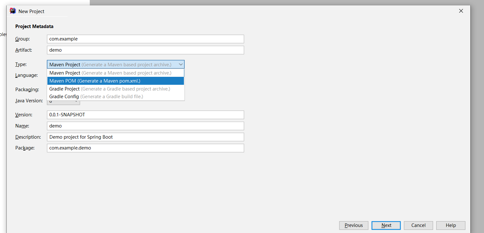
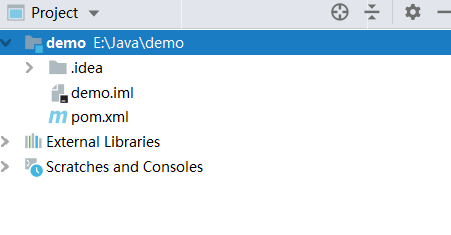
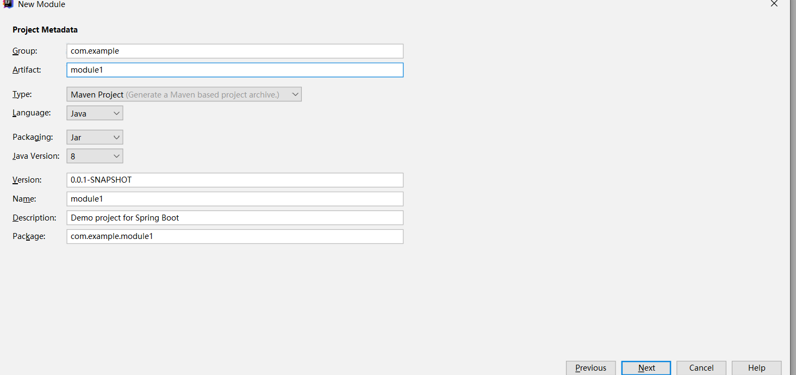
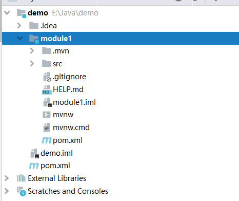
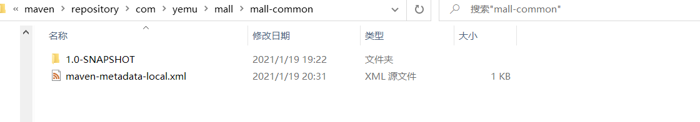

# Maven创建多模块项目
首先创建一个只有pom.xml的父项目。  
<div align=center>

</div>

创建完是这样的
<div align=center>

</div>
然后在这个project中添加module  
<div align=center>

</div>
创建完的目录结构
<div align=center>

</div>
接下来配置pom文件。首先配置父级项目的pom.xml。下面是一个已经配置好的pom.xml    

```XML
<?xml version="1.0" encoding="UTF-8"?>
<project xmlns="http://maven.apache.org/POM/4.0.0"
         xmlns:xsi="http://www.w3.org/2001/XMLSchema-instance"
         xsi:schemaLocation="http://maven.apache.org/POM/4.0.0 http://maven.apache.org/xsd/maven-4.0.0.xsd">
    <modelVersion>4.0.0</modelVersion>
<!--        　　　　　　项目的包名-->
    <groupId>com.yemu.mall</groupId>
    <artifactId>mall</artifactId>
<!--        　　　　　　项目版本-->
    <version>1.0-SNAPSHOT</version>
<!--        　　打包方式，这里选择了pom，因为父级项目没有代码-->
    <packaging>pom</packaging>
<!--        　　　　　　项目描述-->
    <name>mall</name>
    <description>a mall</description>
<!--        　设置包含的模块-->
    <modules>
        <module>mall-portal</module>
        <module>mall-common</module>
    </modules>
<!--        　　　　　　父级依赖-->
    <parent>
        <groupId>org.springframework.boot</groupId>
        <artifactId>spring-boot-starter-parent</artifactId>
        <version>2.2.5.RELEASE</version>
        <relativePath/> <!-- lookup parent from repository -->
    </parent>
<!--        　　　　　　一些项目属性配置-->
    <properties>
        <java.version>1.8</java.version>
        <!--        　　　　　　//设置项目编码-->
        <project.build.sourceEncoding>UTF-8</project.build.sourceEncoding>
        <project.reporting.outputEncoding>UTF-8</project.reporting.outputEncoding>
        <maven.compiler.encoding>UTF-8</maven.compiler.encoding>
<!--        子模块的版本号配置-->
        <mall-common.version>1.0-SNAPSHOT</mall-common.version>
        <mall-portal.version>1.0-SNAPSHOT</mall-portal.version>
    </properties>

<!--    基础依赖 当子模块使用下面的依赖时不需再配置-->
    <dependencies>
        <dependency>
            <groupId>org.springframework.boot</groupId>
            <artifactId>spring-boot-starter-web</artifactId>
        </dependency>
        <!--        MySQL驱动    -->
        <dependency>
            <groupId>mysql</groupId>
            <artifactId>mysql-connector-java</artifactId>
        </dependency>
    </dependencies>

<!--依赖管理 子模块使用时还需要单独引入，但是不需要再写版本号了-->
    <dependencyManagement>
        <dependencies>
<!--            通用模块-->
            <dependency>
                <groupId>com.yemu.mall</groupId>
                <artifactId>mall-common</artifactId>
                <version>${mall-common.version}</version>
            </dependency>
<!--            前台模块-->
            <dependency>
                <groupId>com.yemu.mall</groupId>
                <artifactId>mall-portal</artifactId>
                <version>${mall-portal.version}</version>
            </dependency>
<!--            七牛云SDK-->
            <dependency>
                <groupId>com.qiniu</groupId>
                <artifactId>qiniu-java-sdk</artifactId>
                <version>[7.2.0, 7.2.99]</version>
            </dependency>
        </dependencies>
    </dependencyManagement>
</project>
```
接下来配置子模块的pom.xml  

```XML
<?xml version="1.0" encoding="UTF-8"?>
<project xmlns="http://maven.apache.org/POM/4.0.0" xmlns:xsi="http://www.w3.org/2001/XMLSchema-instance"
         xsi:schemaLocation="http://maven.apache.org/POM/4.0.0 https://maven.apache.org/xsd/maven-4.0.0.xsd">
    <modelVersion>4.0.0</modelVersion>

<!--        　　　模块信息-->
    <groupId>com.yemu.mall</groupId>
    <artifactId>mall-common</artifactId>
    <version>1.0-SNAPSHOT</version>
<!--        　　　　　　打包方式-->
    <packaging>jar</packaging>

    <name>mall-common</name>
    <description>商城通用组件</description>

<!--        　　　　　父级依赖，这里配置为父级项目-->
    <parent>
        <groupId>com.yemu.mall</groupId>
        <artifactId>mall</artifactId>
        <version>1.0-SNAPSHOT</version>
    </parent>

 <!--        父级pom中dependencies下已配置的不需要再配置-->
    <dependencies>
        <!--        七牛云sdk,因为已在父级pom中配置了版本号，这里不再配置，只引入-->
        <dependency>
            <groupId>com.qiniu</groupId>
            <artifactId>qiniu-java-sdk</artifactId>
        </dependency>
    </dependencies>

</project>
```

如果要引入自己的其他项目，比如一个工具库，则只需要使用mvn install到自己的本地库，然后在需要用到的项目中添加依赖引用即可。下面是一个例子：  
1. 首先使用maven install 到本地仓库中  
maven命令：`mvn clean install`  
可以看到mall-common依赖已安装到本地仓库
<div align=center>

</div>
2. 项目中引入   

像引入其他包一样在pom文件中引入即可
```XMl
<dependency>
    <groupId>com.yemu.mall</groupId>
    <artifactId>mall-common</artifactId>
    <version>1.0-SNAPSHOT</version>
</dependency>
```

