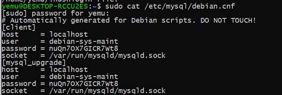
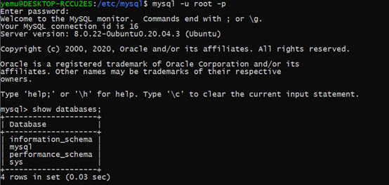
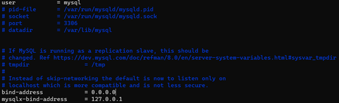

# 在WSL（Ubuntu）中安装MySQL
首先，安装MySQL
`sudo apt install mysql-server`  

启动MySQL服务 `sudo service mysql start`  

在安装过程中并没有让设置密码，因此此时还不能登录  
打开这个文件 `sudo cat /etc/mysql/debian.cnf`

使用里面的user和password登录

`mysql -u debian-sys-maint -p`

切换到mysql数据库

`use mysql;`

修改root的密码

`alter user ‘root’@’localhost’ identified with mysql_native_password by ‘123456’;`

退出mysql

`exit;`

重新使用root和修改的密码登录MySQL

`mysql -u root -p`

安装完成。

实现远程登录：

修改mysqld.cnf文件中的bind-address 为0.0.0.0

`sudo vim /etc/mysql/mysql.conf.d/mysqld.cnf`

重新启动MySQL服务

`sudo service mysql restart`

`mysql -u root -p`

创建新用户，并给新用户赋权限

`create user ‘dev’@’%’ identified by ‘123456’;`

`grant all on *.* to ‘dev’@’%’;`

`alter user ‘dev’@’%’ identified with mysql_native_password by ‘123456’;`

`flush privileges;`

连接：

①在本机上可以使用localhost

（使用一段时间后发现有的时候不能使用localhost连接，只可使用ip可以连接，可通过在宿主机执行wsl –shutdown然后重新打开wsl来暂时解决问题）
②内网使用wsl的ip访问

可以使用sudo apt install net-tools安装net-tools，使用ifconfig查看ip地址

(经过半个多月的使用发现最好还是直接用虚拟机装个Ubuntu。用wsl2总是会有一些奇奇怪怪的问题，比如localhost连不上，各种服务的自启动问题。)