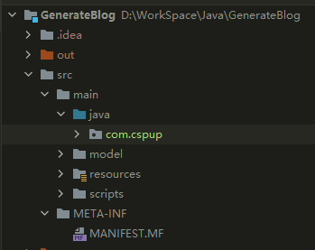

# 使用maven将Java项目打包成zip  
使用maven-assembly-plugin插件，可以灵活配置打包的文件。

1. pomx.xml中的插件配置  

```xml
 <plugin>
    <artifactId>maven-assembly-plugin</artifactId>
    <version>3.3.0</version>
    <configuration>
        <descriptors>
        <!-- 配置文件地址 -->
            <descriptor>src/main/resources/assembly.xml</descriptor>
        </descriptors>
    </configuration>
    <executions>
        <execution>
        <!-- 任务id -->
            <id>assembly</id>
            <!-- 在maven生命周期的哪个阶段 -->
                <phase>package</phase>
                    <goals>
                    <!-- 目标 -->
                        <goal>single</goal>
                    </goals>
        </execution>
    </executions>
</plugin>
```

2. assembly.xml maven-assembly-plugin的配置文件  

```xml
<?xml version="1.0" encoding="UTF-8"?>
<assembly>
    <id>${version}</id>
    <formats>
<!--        打包格式-->
        <format>zip</format>
    </formats>
    <dependencySets>
        <dependencySet>
            <useProjectArtifact>true</useProjectArtifact>
<!--            依赖打包到lib目录下，需使用maven-jar-plugin插件配置<classpathPrefix>lib/</classpathPrefix>-->
            <outputDirectory>lib</outputDirectory>
        </dependencySet>
    </dependencySets>

    <!-- 文件设置，你想把哪些文件包含进去，或者把某些文件排除掉，都是在这里配置-->
    <fileSets>
        <!-- 把项目自己编译出来的可执行jar，打包进zip文件的根目录 -->
        <fileSet>
            <directory>${project.build.directory}</directory>
            <outputDirectory>/</outputDirectory>
            <includes>
                <include>*.jar</include>
            </includes>
        </fileSet>

<!-- model文件输出到/model下 -->
        <fileSet>
            <directory>${project.model.directory}</directory>
            <outputDirectory>model</outputDirectory>
        </fileSet>

<!-- 配置文件输出到根目录 -->
        <fileSet>
            <directory>${project.resources.directory}</directory>
            <outputDirectory>/</outputDirectory>
            <includes>
                <include>config.properties</include>
            </includes>

        </fileSet>
        
<!-- 脚本文件 -->
        <fileSet>
            <directory>${project.script.directory}</directory>
            <outputDirectory>/</outputDirectory>
            <includes>
                <include>*</include>
            </includes>
        </fileSet>

    </fileSets>
</assembly>
```  

3. 项目目录  

<div align=center>

</div>

4. 打包出的目录  

<div align=center>

</div>


 

