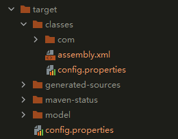

# maven配置编译时资源目录的输出位置
使用maven-resources-plugin插件进行配置，也可以用这个插件将打包后的前端项目输出到Java项目中的文件夹下，然后用tomcat运行前端项目，实现一键启动应用。  

1. pom.xml中的配置  

```xml
<plugin>
    <groupId>org.apache.maven.plugins</groupId>
    <artifactId>maven-resources-plugin</artifactId>
    <version>3.2.0</version>
    <executions>
        <execution>
        <!-- 任务id -->
            <id>copy-models</id>
            <!-- 任务运行在哪个阶段 -->
            <phase>process-sources</phase>
            <!-- 目标 -->
                <goals>
                    <goal>copy-resources</goal>
                </goals>
                <configuration>
                <!-- 输出到编译目录下的model文件夹下 -->
                    <outputDirectory>${project.build.directory}/model</outputDirectory>
                    <!-- 包含空文件夹 -->
                    <includeEmptyDirs>true</includeEmptyDirs>                        <resources>
                        <resource>
                        <!-- 资源目录 -->
                            <directory>src/main/model</directory>
                            <includes>
                            <!-- 包含所有文件 -->
                                <include>**/*</include>
                           </includes>
                        </resource>
                    </resources>
                </configuration>
        </execution>
    </executions>
</plugin>
```

2. 项目目录   

<div align=center>

</div>

3. maven编译出的目录  

<div align=center>

</div>

